<div align="center">
<picture>
  <source media="(prefers-color-scheme: dark)" srcset=".github/brand/banner-night.svg">
  
</picture>
<br><br>
<a href="#what-its-meant-to-be"><picture><source media="(prefers-color-scheme: dark)" srcset=".github/brand/tab-what-its-meant-to-be-night.svg"></picture></a>
<a href="#status"><picture><source media="(prefers-color-scheme: dark)" srcset=".github/brand/tab-status-night.svg"></picture></a>
</div>

<p>
<a name="what-its-meant-to-be"></a>
<picture><source media="(prefers-color-scheme: dark)" srcset=".github/brand/section-what-its-meant-to-be-night.svg"></picture>
</p>

A system dashboard with *predictive* load forecasting — not just "CPU is at 40% now" but "CPU will be at 70% in five minutes."

<p>
<a name="status"></a>
<picture><source media="(prefers-color-scheme: dark)" srcset=".github/brand/section-status-night.svg"></picture>
</p>

| Module | Today | Planned |
|--------|-------|---------|
| `backend::collector` | ✅ Real — pulls live CPU %, memory %, and network in/out via the `sysinfo` crate | — |
| `backend::predict::forecast()` | ⚠️ Stub — always returns `0.0` for both CPU and memory | Actual time-series forecasting from snapshot history |
| `backend::analytics::emit()` | ✅ Real — prints a formatted snapshot + forecast line | Structured output / dashboard UI |

> [!NOTE]
> The system-stats collection genuinely works today. The "predictive analytics" half of the name doesn't exist yet — `forecast()` is a hardcoded no-op.

```sh
git clone https://github.com/NoamFav/Astrotop && cd Astrotop
cargo run
```

<div align="center">
Made with ♥ by <a href="https://github.com/NoamFav">NoamFav</a>
</div>

<br>

<a href="https://nf-software.com">
<picture>
  <source media="(prefers-color-scheme: dark)" srcset=".github/brand/footer-night.svg">
  
</picture>
</a>
